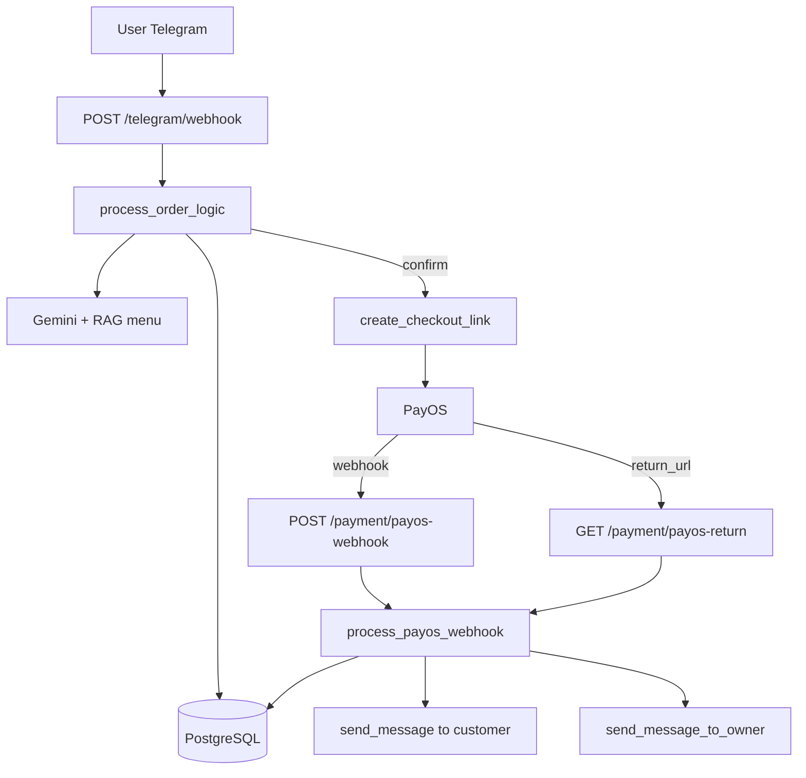

# Milk Tea Telegram Bot

Bot đặt đồ uống qua Telegram, có tích hợp AI để hiểu ngôn ngữ tự nhiên và PayOS để tạo link thanh toán.

## Mục tiêu dự án

- Nhận tin nhắn Telegram và hiểu ý định đặt món bằng AI.
- Quản lý đơn nháp theo từng user Telegram.
- Hỗ trợ thêm/xóa/đổi món, topping-only, thay thế món.
- Tạo link thanh toán PayOS cho đơn hàng.
- Nhận webhook/callback từ PayOS để chốt đơn và gửi thông báo cho chủ quán.

## Công nghệ sử dụng

- Python + FastAPI
- SQLAlchemy + PostgreSQL (Neon)
- Telegram Bot API
- Gemini (qua langchain_google_genai) + Qdrant local cho truy xuất menu
- PayOS SDK

## Cấu trúc chính

```text
app/
	api/
		telegram.py         # webhook Telegram + xử lý hội thoại đặt hàng
		payment.py          # webhook và callback trả về từ PayOS
	core/
		config.py           # đọc biến môi trường
		database.py         # SQLAlchemy engine/session
	dto/                  # schema input/output
	models/               # bảng orders/order_items/payments
	services/
		ai_service.py       # trích xuất intent/items từ tin nhắn
		menu_service.py     # đọc và tìm kiếm menu CSV
		order_service.py    # thao tác đơn hàng
		payos_service.py    # tạo link thanh toán + xử lý paid
		telegram_service.py # gửi tin nhắn Telegram
data/
	menu.csv              # menu chính
```

## Biến môi trường

Tạo file `.env` với các biến:

```dotenv
DATABASE_URL=postgresql+psycopg://<user>:<pass>@<host>/<db>?sslmode=require&channel_binding=require

GEMINI_API_KEY=<your_gemini_key>

PAYOS_CLIENT_ID=<your_payos_client_id>
PAYOS_API_KEY=<your_payos_api_key>
PAYOS_CHECKSUM_KEY=<your_payos_checksum_key>

TELEGRAM_BOT_TOKEN=<your_bot_token>
TELEGRAM_BOT_USERNAME=<your_bot_username>
TELEGRAM_OWNER_CHAT_ID=<owner_chat_id>

APP_BASE_URL=https://<your-public-domain>
TELEGRAM_WEBHOOK_SECRET=<optional>
```

Lưu ý:

- `APP_BASE_URL` phải là domain gốc public, không kèm path.
- Ví dụ đúng: `https://abc.ngrok-free.app`
- Ví dụ sai: `https://abc.ngrok-free.app/payment/payos-webhook`

## Cài đặt và chạy

1. Tạo môi trường ảo và cài dependencies

```bash
python -m venv venv
venv\Scripts\activate
pip install -r requirements.txt
```

2. Chạy server

```bash
uvicorn app.main:app --host 0.0.0.0 --port 8000 --reload
```

3. Expose local bằng ngrok

```bash
ngrok http 8000
```

4. Cấu hình webhook

- Telegram webhook: `https://<public-domain>/telegram/webhook`
- PayOS webhook: `https://<public-domain>/payment/payos-webhook`

## API chính

- `POST /telegram/webhook`
  - Nhận tin nhắn Telegram và xử lý đơn hàng trong background task.

- `POST /payment/payos-webhook`
  - Nhận tín hiệu thanh toán từ PayOS.

- `GET /payment/payos-return`
  - Fallback callback khi PayOS redirect về sau thanh toán.
  - Dùng `orderCode` query param để xác minh trạng thái thanh toán.

## Luồng hoạt động

### 1) Luồng đặt hàng Telegram

1. User gửi tin nhắn vào bot Telegram.
2. `POST /telegram/webhook` nhận update và đẩy vào `process_order_logic`.
3. Bot mở DB session và lấy/tạo draft order theo `platform_user_id`.
4. `ai_service.extract_order_data()` phân tích intent/items/info khách.
5. Bot áp dụng rule:
   - add: thêm món/topping
   - remove: bớt/xóa món hoặc bỏ topping
   - substitute: xóa món cũ + thêm món mới
   - replace_all: xóa toàn bộ đơn cũ rồi thêm danh sách mới
6. Bot cập nhật tổng tiền + thông tin giao hàng.
7. Nếu user xác nhận và đủ thông tin, bot gọi tạo link PayOS.

### 2) Luồng tạo thanh toán PayOS

1. `create_checkout_link()` sinh `payment_ref` dạng UUID.
2. Từ `payment_ref` tạo `order_code` số duy nhất cho PayOS.
3. Gọi PayOS tạo link thanh toán.
4. Lưu record vào bảng `payments` ở trạng thái `pending`.
5. Trả `checkout_url` về chat Telegram.

### 3) Luồng chốt thanh toán và thông báo chủ quán

1. Khi thanh toán thành công, PayOS gọi `POST /payment/payos-webhook`.
2. Service map `orderCode` về record `payments`.
3. Cập nhật payment `pending -> paid`.
4. Cập nhật order `draft -> paid`.
5. Gửi:
   - Tin xác nhận cho khách.
   - Tin báo đơn mới cho `TELEGRAM_OWNER_CHAT_ID`.
6. Nếu webhook không đến, callback `GET /payment/payos-return` sẽ xác minh lại trạng thái và tái dùng luồng webhook.

## Sơ đồ luồng tổng quát



## Quy tắc xử lý hội thoại nổi bật

- Đặt mỗi topping riêng vẫn được (topping-only).
- Nếu user nói thêm thì cộng vào order hiện tại.
- Nếu user nói xóa món nào thì chỉ xóa món đó.
- Nếu user nói đổi A qua B thì xóa A và thêm B.
- Nếu user không nói thêm/xóa/đổi mà gửi danh sách món mới độc lập, bot có thể hiểu là làm lại đơn.

## Logging và vận hành

- SQL log bật/tắt tại `app/core/database.py` bằng tham số `echo`.
- Nếu muốn bớt log uvicorn:

```bash
uvicorn app.main:app --host 0.0.0.0 --port 8000 --log-level warning --no-access-log
```
